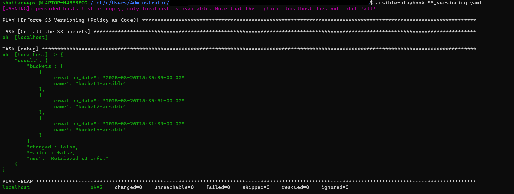
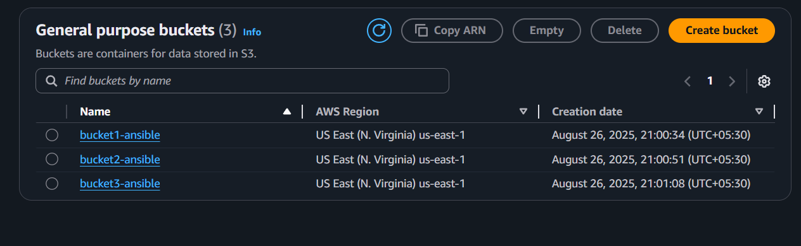
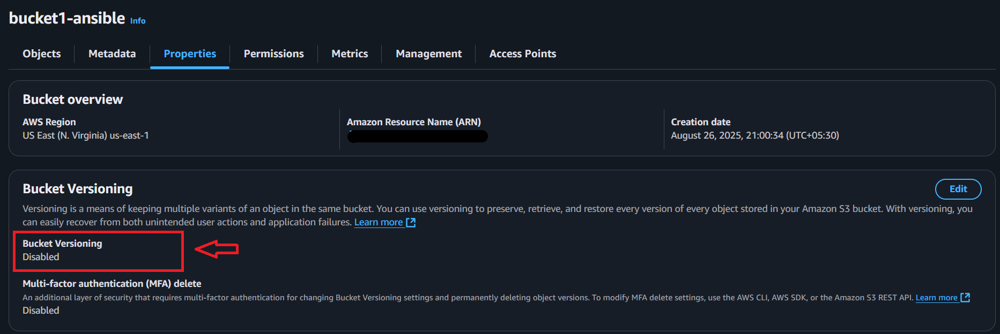
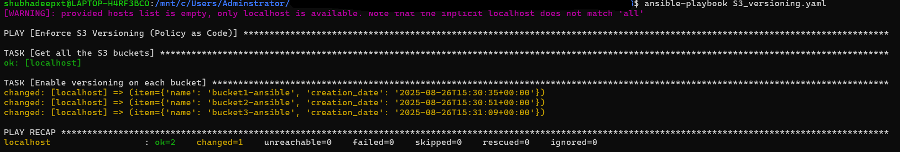
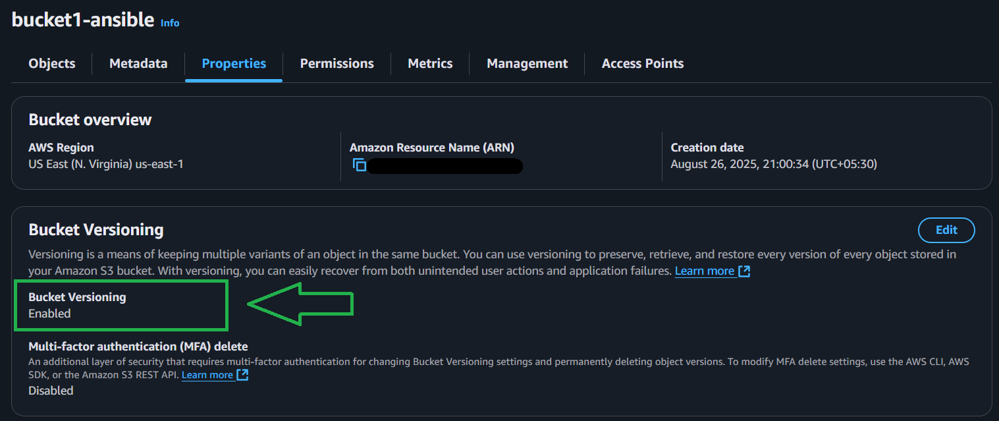

# 🛡️ Policy as Code (PaC) with Ansible – DevSecOps Demo

## 📌 Project Overview
This project demonstrates **Policy as Code (PaC)** using **Ansible** to enforce security and compliance in AWS. 
The chosen use case: **Enable versioning on all S3 buckets** in an AWS account.

**Why Policy as Code?**
- Manual security enforcement is **slow and error-prone**.
- At scale (hundreds of S3 buckets, EC2 instances, IAM users), it’s **impossible** to track manually.
- PaC makes rules:
  - **Automated** 
  - **Consistent** 
  - **Auditable** 
  - **Remediable**

**Example Risk:** A developer accidentally makes an S3 bucket public. With PaC, you can **automatically enforce rules** to prevent or fix misconfigurations.

---

## 🎯 Why Ansible for PaC?
- **Simple & Declarative**: YAML-based playbooks are easy to read/write 
- **Idempotent**: Safe to re-run, fixes drift automatically 
- **AWS Native**: Strong support via `amazon.aws` collection 
- **Great for SecOps**: Enables repeatable, auditable compliance automation

---

## 🛠️ Project Structure

.
├── README.md
├── S3_versioning.yaml
└── screenshots
    ├── 01_cli_list_buckets.png
    ├── 02_ui_list_buckets.png
    ├── 03_ui_versioning_disabled.png
    ├── 04_cli_versioning_enabled.png
    └── 05_ui_versioning_enabled.png

---

## 🚀 How It Works

- Playbook Task 1: Get all S3 buckets (amazon.aws.s3_bucket_info)
- Playbook Task 2: Loop through buckets and enable versioning (amazon.aws.s3_bucket)
- Verification: Confirm via CLI + AWS Console UI

---

## 📂 Screenshots

### 1) Listing S3 Buckets
- CLI output: 

- AWS Console: 

---

### 2) Before Enabling Versioning
- Bucket versioning disabled: 

---

### 3) After Enabling Versioning
- CLI confirmation: 

- AWS Console confirmation: 

---

## ✅ Results

- All S3 buckets now have versioning enabled.
- Demonstrates Policy as Code in a real-world DevSecOps use case.

---

## 📌 Future Extensions

- Enforce S3 bucket encryption (SSE-S3/SSE-KMS)
- Ensure IAM password policies
- Auto-attach IAM roles to EC2 instances
- Extend PaC to Terraform Sentinel / OPA Gatekeeper

---

## 🙏 Credits

- Project inspired by Abhishek Veeramalla
- Video Reference: https://youtu.be/CZxJ2Sr1o7w?si=ysBYcM9m01IfSiz4

